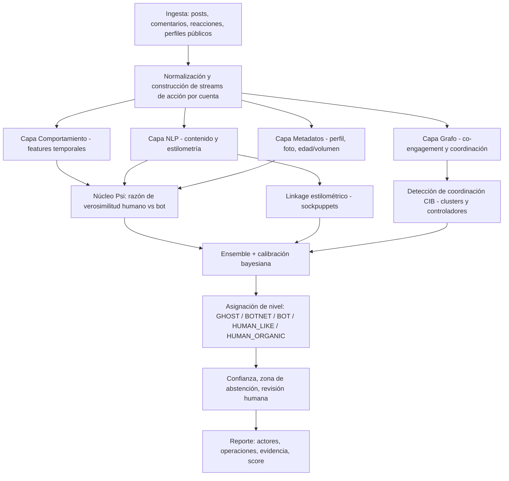

# NULLSEC // ARGOS‑Ψ
## Documento Técnico y Ficha Algorítmica — Sistema de Detección de Inautenticidad y Coordinación en Facebook

> **Clasificación:** Técnico / Ingeniería de detección
> **Propósito:** Especificación de referencia para construir un motor de detección y clasificación de cuentas automatizadas y coordinadas en Facebook.
> **Audiencia de destino:** Un agente de IA / desarrollador que implementará el sistema en código.
> **Versión:** 1.0

---

## 0. Qué ES y qué NO ES este sistema (léelo primero)

**ES:** un sistema de *detección de comportamiento inauténtico coordinado (CIB)* y *automatización*, basado en métodos forenses reales (análisis temporal, NLP, grafos sociales y razón de verosimilitud probabilística). Es defensivo: sirve para **detectar** ataques de bots contra una persona o página, no para construirlos.

**NO ES:**
- **No es "cuántico".** No existe computación cuántica aplicable ni necesaria aquí. Donde otras IA dijeron "proceso cuántico", lo correcto es **inferencia bayesiana secuencial + razón de verosimilitud (likelihood ratio) entre un modelo humano y un modelo bot**. Eso es lo que produce la sensación de "el sistema reconoce al bot como lo haría un humano". Es real, es elite, y está en el núcleo (capa Ψ).
- **No tiene acceso a datos internos de Meta.** Un tercero NO ve: curva/telemetría del ratón, presión táctil, IP real, fingerprint de hardware del lado servidor, cookies. Cualquier diseño que dependa de eso es inútil para ti. Todo aquí se construye sobre **señales públicas / API**.
- **No es un veredicto, es una probabilidad calibrada.** En contexto político, etiquetar a un humano real como "bot" tiene consecuencias graves. El sistema entrega *scores con intervalos de confianza* y una *zona de abstención*, con revisión humana obligatoria para decisiones de alto impacto.

**Disciplina de honestidad del sistema (regla de oro):** ante la duda, el sistema **prefiere el falso negativo sobre el falso positivo**. Es mejor dejar pasar un bot dudoso que quemar a un humano real.

---

## 1. Realidad operativa: qué señales SÍ puedes capturar

El poder del sistema depende de no autoengañarse con datos que no existen. Tres capas de acceso:

| Capa | Señales disponibles | Vía |
|---|---|---|
| **Pública directa** | Texto de posts/comentarios, timestamps de publicación, conteo público de reacciones/comentarios/shares, nombre visible, foto de perfil pública, URL vanity, "se unió en…" cuando es visible, lista pública de páginas que administra (a veces) | Observación de páginas/posts públicos |
| **Graph API (limitada)** | Metadatos de objetos públicos, insights de TUS propias páginas (engagement, demografía agregada), webhooks de comentarios en tus páginas | Permisos de la página que tú controlas |
| **Derivada (computada por ti)** | Latencia de reacción (post → comentario), sincronización entre cuentas, similitud de texto, embeddings, huella estilométrica, pHash de fotos, ritmo circadiano reconstruido | Tu pipeline |

**Lo que NO podrás obtener (es solo de Meta):** IP, fingerprint de dispositivo, movimiento del cursor, sesión interna, historial completo de actividad privada. **Diseña sin ello.**

> **Nota legal/ToS:** el scraping masivo de Facebook viola los Términos de Meta y puede tener implicaciones legales según jurisdicción. Para monitoreo legítimo, prioriza datos de **tus propias páginas** vía API y observación de contenido público acotado. Esto es contexto, no asesoría legal.

---

## 2. Taxonomía de actores (los 5 niveles + la línea base)

El diseño parte de un principio: **cada nivel se detecta mejor en una capa distinta del sistema.** No existe un solo feature que los atrape a todos.

### Nivel 0 — `HUMAN_BASELINE` (humano normal) — *referencia*
Usuario genuino, actividad irregular, embebido en una red real, contenido diverso. Es el modelo contra el que todo se compara. **Nunca se etiqueta como amenaza.**

### Nivel 1 — `HUMAN_ORGANIC` (humano hiperactivo / amplificador genuino)
Persona real que comenta de forma parecida en muchas notas/páginas porque le apasiona el tema (política, fútbol, etc.). **NO es bot.** Es la frontera más peligrosa de falso positivo.
- **Firma:** alta actividad PERO con red social genuina, ritmo circadiano humano (duerme), latencias variables, contenido con variación semántica real, errores tipográficos orgánicos.
- **Discriminador clave vs. bot:** está *embebido* en la red (amigos reales que interactúan de vuelta) y su verosimilitud bajo el modelo humano es ALTA pese a su volumen.
- **Detectada en:** capa de grafo (embeddedness) + capa Ψ (likelihood humano alto).

### Nivel 2 — `BOT` (bot estándar)
Cuenta automatizada que reacciona y comenta con scripts. El más fácil.
- **Firma:** baja diversidad léxica, latencias casi nulas o intervalos regulares, baja entropía circadiana, perfil incompleto, foto reusada/generada, poca o nula red genuina.
- **Detectada en:** capa de comportamiento (heurística + Ψ individual).

### Nivel 3 — `HUMAN_LIKE` (cuenta falsa / sockpuppet operada por persona)
Persona real que opera varias cuentas/personas falsas (multi-perfil). Comportamiento "humano" pero múltiples identidades de un mismo operador.
- **Firma:** distintas cuentas comparten **huella estilométrica** (misma persona escribiendo), patrones de horario solapados, alternancia de actividad (nunca activas simultáneamente porque es una sola persona), reciclaje de frases/recursos.
- **Discriminador clave:** linkage estilométrico + anti‑correlación temporal (turnos) entre cuentas.
- **Detectada en:** capa NLP/estilometría + capa de coordinación (vínculo de autoría).

### Nivel 4 — `BOTNET_NODE` (controlador / orquestador)
Nodo que comanda y coordina a muchos bots; el cerebro de la operación.
- **Firma:** altísima centralidad en el grafo de coordinación, patrón "maestro de tiempos" (otros nodos disparan justo después de él), fan‑out alto, a veces se disfraza de cuenta normal.
- **Discriminador clave:** centralidad + precedencia temporal (es quien marca el ritmo del cluster).
- **Detectada en:** capa de grafo/coordinación (centralidad + causalidad temporal).

### Nivel 5 — `GHOST` (operador élite de baja huella)
El más sofisticado: cuenta(s) que evaden la detección individual (simulan ritmo circadiano, pausas aleatorias, lenguaje variado, red parcialmente genuina). Casi invisibles cuenta‑por‑cuenta.
- **Firma:** individualmente parece humano (Ψ casi neutro). Solo se delata por **correlaciones sutiles a nivel red**: aparece de forma sistemática en operaciones coordinadas, comparte huellas operacionales finísimas (mismas ventanas de actividad, mismos targets, mismas cadenas de difusión) con otros nodos.
- **Discriminador clave:** **no se detecta solo; se detecta por su recurrencia en clusters coordinados.** Solo la capa de coordinación + análisis longitudinal lo saca.
- **Detectada en:** capa de coordinación (recurrencia en múltiples operaciones) + análisis temporal de largo plazo.

> **Insight central de arquitectura:**
> `BOT` → capa de comportamiento. `HUMAN_LIKE` → estilometría/linkage. `BOTNET_NODE` y `GHOST` → grafo de coordinación. `HUMAN_ORGANIC` → protegido por embeddedness + Ψ humano alto. **Por eso el sistema es multicapa: cada capa caza lo que las otras no pueden.**

---

## 3. Arquitectura del sistema



**Flujo lógico:**
1. **Ingesta** → recolecta eventos observables.
2. **Stream de acción por cuenta** → cada cuenta se convierte en una secuencia tokenizada `(tipo_acción, Δt, target, payload)`.
3. **4 capas de features** corren en paralelo.
4. **Núcleo Ψ** calcula la razón de verosimilitud (el "cerebro predictivo").
5. **Capa de coordinación** detecta redes/clusters y controladores.
6. **Ensemble + calibración** fusiona todo en una probabilidad por nivel.
7. **Asignación + confianza + humano en el loop** → reporte final.

---

## 4. Ingeniería de características (el sustrato real)

Para cada cuenta se computan vectores en 4 familias. Todas las fórmulas usan solo datos observables.

### 4.1 Familia TEMPORAL (delata al `BOT`, mide "humanidad" del ritmo)

- **Burstiness B** (Goh & Barabási):
  `B = (σ_τ − μ_τ) / (σ_τ + μ_τ)`, donde `τ` = tiempos inter‑evento.
  Humano: B moderado/positivo (ráfagas + pausas). Script periódico: B ≈ −1 (regular). Útil para separar regularidad robótica de irregularidad humana.
- **Entropía circadiana** `H_circ`: distribuye la actividad en 24 bins horarios → Shannon entropy normalizada. Humano duerme → entropía < máxima y con valle nocturno. Bot 24/7 → entropía plana/alta sin valle.
  Feature derivado: **profundidad del valle de sueño** (ratio actividad nocturna/diurna).
- **Latencia de reacción** `L`: tiempo entre publicación del post objetivo y el comentario/reacción de la cuenta. Distribución de L: humanos = log‑normal con cola; bots = picos en L→0 o L constante.
- **Índice de regularidad** `R`: autocorrelación del tren de eventos / detección de periodicidad (FFT sobre la serie de actividad). Picos espectrales fuertes = automatización con cron.
- **Diversidad de sesión / profundidad**: nº de tipos de acción distintos por ventana (un bot spammer hace 1 cosa; humano hojea, reacciona, comenta, borra).

### 4.2 Familia NLP / CONTENIDO (delata texto generado y plantillas)

- **Type‑Token Ratio (TTR)** y **entropía léxica**: baja diversidad = plantillas o generación pobre.
- **Detección de casi‑duplicados entre cuentas:** **SimHash** (Charikar) + **MinHash/LSH** (`datasketch`) sobre comentarios. Si N cuentas emiten textos a distancia de Hamming/Jaccard mínima → señal fortísima de coordinación.
- **Similitud semántica:** embeddings (`sentence-transformers`, multilingüe para español) → coseno entre comentarios de distintas cuentas. Captura "mismo guion, palabras distintas".
- **Huella estilométrica** (clave para `HUMAN_LIKE`): vector de frecuencias de **function words** (preposiciones, artículos, conectores), distribución de n‑gramas de caracteres, longitud media de oración, uso de puntuación/emojis, ortografía. Distancia tipo **Burrows's Delta** para vincular cuentas a un mismo autor.
- **Ratios de superficie:** emoji/token, URL/token, mención/token, mayúsculas/token. Bots baratos saturan estos.
- **Perplejidad** bajo un modelo de lenguaje: texto demasiado "promedio" (perplejidad anómalamente baja/estable) puede indicar generación o copia.

### 4.3 Familia METADATOS / PERFIL

- **Ratio edad‑vs‑volumen:** cuenta recién creada con volumen de actividad altísimo = bandera. `volumen / edad_cuenta`.
- **Completitud del perfil:** campos vacíos, foto única, sin historial = correlaciona con cuentas desechables.
- **Análisis de foto de perfil:**
  - **pHash + búsqueda inversa** (hash perceptual) → ¿foto robada/reusada en muchas cuentas?
  - **Detección de rostro sintético (GAN/diffusion):** artefactos de frecuencia, simetrías oculares, fondos inconsistentes. *Aviso: es carrera armamentista; trátalo como señal débil, no prueba.*
- **Entropía del nombre / patrón vanity URL:** nombres aleatorios o URLs tipo `profile.php?id=` masivas en un cluster.

### 4.4 Familia GRAFO / RED (delata `BOTNET`, `GHOST` y protege `HUMAN_ORGANIC`)

- **Embeddedness / reciprocidad:** ¿la cuenta tiene interacciones de VUELTA de cuentas genuinas? Los humanos reales viven en redes recíprocas; los anillos de bots solo se conectan entre sí.
- **Coeficiente de clustering local** y pertenencia a componentes densos aislados.
- **Embeddings de grafo:** `node2vec` / `GraphSAGE` sobre el grafo de interacción → detección de anomalías (cuentas cuyo embedding cae fuera de la variedad "humana").
- **Centralidad** (degree, betweenness, eigenvector) en el grafo de coordinación → candidatos a `BOTNET_NODE`.

---

## 5. EL CORAZÓN PREDICTIVO — Núcleo Ψ (razón de verosimilitud humano vs. bot)

> Esto es lo que reemplaza el humo "cuántico" por algo real y devastadoramente efectivo. La idea: **no preguntamos "¿este patrón parece bot?"; preguntamos "¿el comportamiento de esta cuenta lo predice mejor un modelo de humano o un modelo de bot?"** Eso es lo que hace que "parezca que el sistema reconoce a un humano".

### 5.1 Tokenización del stream
Cada cuenta = secuencia `S = [(a₁, Δt₁, tgt₁), (a₂, Δt₂, tgt₂), …]` donde `a` ∈ {comentar, reaccionar, compartir, publicar, seguir…}.

### 5.2 Dos modelos generativos

- **Modelo Humano `H`:** aprendido de cuentas humanas verificadas (o curadas). Captura:
  - tiempos inter‑evento como **proceso de Hawkes** (auto‑excitante: ráfagas seguidas de calma) + valle circadiano.
  - secuencia de acciones como **Markov de orden variable (PPM)** o LSTM/Transformer pequeño → captura la variabilidad caótica humana.
- **Modelo Bot `A`:** aprendido de bots conocidos *o* definido paramétricamente (proceso periódico/Poisson para tiempos, baja entropía de transición de acciones, latencias→0).

### 5.3 Score Ψ — log‑likelihood ratio
Para una cuenta con stream `S`:

```
Ψ(S) = log P(S | A) − log P(S | H)
```

- `Ψ ≫ 0` → el comportamiento es **mucho mejor explicado por el modelo bot** → automatización probable.
- `Ψ ≈ 0` → ambiguo (aquí viven los GHOST y los humanos hiperactivos → zona de abstención individual).
- `Ψ ≪ 0` → fuertemente humano (protege a `HUMAN_ORGANIC` aunque tenga alto volumen).

**Por qué es "predictivo":** ambos modelos predicen la *siguiente acción/tiempo*. Si la próxima acción real de la cuenta es altamente probable bajo `A` e improbable bajo `H`, suma evidencia bot. Se actualiza **online** conforme llega nueva actividad (`river` para streaming).

### 5.4 Actualización bayesiana secuencial (el "predictivo" honesto)
Mantén una creencia posterior por cuenta:

```
posterior_t ∝ likelihood(evidencia_t) × posterior_{t-1}
```

El "prior" depende del contexto (p. ej., en una nota que ya sufre un ataque coordinado, el prior de inautenticidad sube). Cada nueva acción actualiza la probabilidad. Esto da una creencia que **se afina con el tiempo** en lugar de un veredicto de un solo disparo — el equivalente real y riguroso a lo que pedías como "cuántico/predictivo".

---

## 6. Detección de coordinación (CIB) — cómo saber que varios bots se relacionan y coordinan

> Esto responde directo a tu requerimiento: *"que detecte si se están relacionando varios bots y coordinando entre sí"*. Es el subsistema que caza `BOTNET` y `GHOST`.

### 6.1 Construcción del grafo de co‑engagement
1. Toma todas las cuentas que interactuaron con el mismo objetivo (post, página, persona) dentro de una ventana `Δt`.
2. Construye un grafo bipartito **cuenta ↔ contenido/acción**.
3. Proyéctalo a un grafo **cuenta ↔ cuenta**, ponderando aristas por:
   - **co‑ocurrencia temporal:** cuántas veces actuaron sobre el mismo target dentro de `Δt` (con decaimiento temporal: más cerca en el tiempo, más peso).
   - **similitud de contenido:** coseno de embeddings / distancia SimHash de lo que publicaron.
   - **sincronía de secuencia:** similitud de sus vectores de actividad binados en el tiempo (coseno o DTW).

### 6.2 Extracción de operaciones (clusters)
- Umbraliza el grafo (quita aristas débiles) → aplica **detección de comunidades** (Louvain / Leiden) o clustering sobre embeddings de grafo.
- Cada comunidad densa y temporalmente sincronizada = **candidata a operación coordinada**.
- Métrica por cluster: **score de coordinación** = combinación de densidad interna, sincronía temporal media y similitud de contenido media. Clusters humanos orgánicos puntúan bajo (sincronía floja, contenido diverso); operaciones de bots puntúan alto.

### 6.3 Identificación de roles dentro del cluster
- **`BOTNET_NODE` (controlador):** mayor centralidad + **precedencia temporal** (test de causalidad tipo Granger / análisis de quién dispara primero y el resto sigue dentro de segundos).
- **`BOT`:** miembros con Ψ individual alto.
- **`GHOST`:** miembros con Ψ individual ≈ neutro PERO que **reaparecen en múltiples operaciones distintas a lo largo del tiempo** (persistencia inter‑operación). Este es el sello del fantasma: invisible por cuenta, visible por recurrencia.

### 6.4 Vínculo de sockpuppets (`HUMAN_LIKE`)
- Sobre el conjunto de cuentas, corre **clustering estilométrico** (distancia de autoría) + **anti‑correlación temporal** (cuentas que nunca están activas al mismo tiempo = posible un solo operador por turnos) → agrupa personas que manejan múltiples perfiles.

---

## 7. Fusión, calibración y asignación de nivel

### 7.1 Ensemble de scoring por cuenta
Modelo tabular **gradient boosting** (LightGBM/XGBoost) que toma como features:
`[features temporales, NLP, metadatos, embedding de grafo, Ψ, score de coordinación del cluster al que pertenece, linkage estilométrico]`
→ produce probabilidades por clase.

### 7.2 Calibración
- **Platt scaling / isotonic regression** para que la probabilidad signifique algo real (un 0.8 = ~80% de aciertos en validación).
- **Zona de abstención:** si la probabilidad cae en `[θ_low, θ_high]`, el sistema responde `INDETERMINADO` y manda a revisión humana. **Esto no es debilidad: es lo que evita quemar humanos.**

### 7.3 Lógica de decisión de nivel (no es un solo umbral)

```
si embeddedness_genuina ALTA y Ψ ≪ 0:
        -> HUMAN_ORGANIC   (protegido, aunque sea hiperactivo)

si Ψ ≫ 0 y red_genuina ~nula y diversidad_contenido baja:
        -> BOT

si linkage_estilometrico fuerte entre varias cuentas + turnos temporales:
        -> HUMAN_LIKE (sockpuppets del mismo operador)

si pertenece a cluster coordinado y centralidad ALTA y marca el ritmo:
        -> BOTNET_NODE

si Ψ ~ neutro PERO recurrencia en múltiples operaciones coordinadas:
        -> GHOST

si nada supera confianza mínima:
        -> INDETERMINADO -> revisión humana
```

La decisión final combina **score individual + rol en el grafo + confianza**. Un solo número nunca decide un nivel de alto impacto.

---

## 8. FICHA ALGORÍTMICA (Algorithm Card)

| Campo | Especificación |
|---|---|
| **Nombre** | ARGOS‑Ψ |
| **Objetivo** | Detección y clasificación de cuentas automatizadas e inauténticas, y de operaciones coordinadas, en Facebook |
| **Entradas** | Streams de acción por cuenta (acción, Δt, target, texto), metadatos de perfil públicos, foto de perfil, grafo de interacción derivado |
| **Salidas** | Por cuenta: nivel ∈ {HUMAN_ORGANIC, BOT, HUMAN_LIKE, BOTNET_NODE, GHOST, INDETERMINADO} + probabilidad calibrada + evidencia. Por operación: cluster + score de coordinación + controladores |
| **Componentes** | (1) Feature engineering 4 familias; (2) Núcleo Ψ likelihood‑ratio humano/bot; (3) Detección de coordinación por grafo; (4) Linkage estilométrico; (5) Ensemble GBM + calibración; (6) Capa de confianza/abstención |
| **Modelos** | Hawkes + Markov/PPM o LSTM (Ψ); node2vec/GraphSAGE (grafo); LightGBM (fusión); sentence‑transformers (NLP); MinHash/SimHash (duplicados) |
| **Parámetros clave** | `Δt` ventana de coordinación; pesos de decaimiento temporal; `θ_low/θ_high` zona de abstención; umbral de aristas del grafo; resolución de comunidades (Louvain/Leiden) |
| **Complejidad** | Features O(N·L). Grafo de coordinación: la proyección bipartita es el cuello de botella → usar LSH/MinHash para candidatos y particionar por target/ventana. Comunidades: ~O(E log N) |
| **Dependencias** | Python; pandas, numpy, scikit‑learn, lightgbm, networkx/igraph, sentence‑transformers, datasketch, river (online), opcional torch (modelo de secuencia) |
| **Datos de entrenamiento** | Conjunto curado de cuentas humanas verificadas + bots conocidos; etiquetado parcial; aprendizaje semi‑supervisado en grafo para propagar etiquetas |
| **Métricas de evaluación** | Precision/Recall por nivel, AUC‑PR (clases desbalanceadas), **tasa de falsos positivos sobre HUMAN_ORGANIC** (métrica crítica), pureza de clusters de coordinación |
| **Modos de fallo conocidos** | Bots avanzados con ritmo circadiano simulado (mitiga: capa de coordinación); deriva del modelo por adaptación adversaria (mitiga: reentrenamiento online); falsos positivos en humanos hiperactivos (mitiga: embeddedness + Ψ + abstención); detección de rostro GAN poco fiable (tratar como señal débil) |
| **Postura ética** | Probabilístico, no veredicto; prefiere falso negativo; revisión humana en alto impacto; no usar para suprimir disenso genuino |

---

## 9. Controles de calidad, sesgo y ética operativa (parte de la ingeniería, no decoración)

En un contexto político (tu caso real), un detector de bots mal usado se convierte en un arma para deslegitimar oposición genuina. Para que el sistema sea de verdad de nivel élite —y defendible— necesita estos controles **como parte del diseño**:

1. **Protección anti‑falso‑positivo:** la métrica número uno es la FPR sobre `HUMAN_ORGANIC`. Optimiza para minimizarla.
2. **Zona de abstención + humano en el loop:** ninguna acción de alto impacto (reportar, bloquear, acusar públicamente) se dispara por score automático solo.
3. **Evidencia auditable:** todo nivel asignado debe venir con la evidencia concreta (qué features, qué cluster, qué sincronía). Sin caja negra para decisiones que afectan personas.
4. **No weaponizar:** el sistema detecta *automatización y coordinación*, no "gente que opina distinto". Un humano organizado y apasionado (`HUMAN_ORGANIC`) no es una amenaza.
5. **Monitoreo de deriva:** los operadores adversarios adaptan; reentrena y revisa la calibración periódicamente.

---

## 10. Stack y roadmap de construcción

**Stack sugerido:**
- **Ingesta/almacenamiento:** Python, Postgres/SQLite (según escala), parquet para features.
- **Features:** pandas, numpy, scipy (FFT/periodicidad), datasketch (MinHash), sentence‑transformers (embeddings multilingües ES).
- **Grafo:** networkx (prototipo) → igraph/graph‑tool (escala); node2vec.
- **ML:** scikit‑learn, lightgbm; opcional torch para el modelo de secuencia del núcleo Ψ; river para online.
- **Servicio:** FastAPI (encaja con tu stack actual) + webhooks de la Graph API para tus páginas.

**Fases:**
1. **MVP de comportamiento:** ingesta + features temporales/NLP + Ψ con Markov/Hawkes → caza `BOT`. (Mayor ROI inmediato.)
2. **Coordinación:** grafo de co‑engagement + comunidades → caza `BOTNET`/operaciones.
3. **Estilometría:** linkage de sockpuppets → `HUMAN_LIKE`.
4. **Longitudinal:** persistencia inter‑operación → `GHOST`.
5. **Calibración + abstención + dashboard de evidencia + revisión humana.**

---

## 11. Handoff para el otro Claude (brief de construcción)

> Pega esto junto con el documento al construir el código.

**Construye ARGOS‑Ψ en Python siguiendo este documento. Restricciones no negociables:**
- **No** asumas acceso a datos internos de Meta (sin IP, sin telemetría de ratón, sin fingerprint de dispositivo). Usa solo señales públicas/API descritas en §1.
- **No** uses "cuántico"; implementa el núcleo Ψ como **razón de verosimilitud humano vs. bot** (§5) con actualización bayesiana online.
- Implementa por fases (§10), empezando por el MVP de comportamiento.
- **Calibra** las probabilidades (isotonic/Platt) e implementa **zona de abstención** + salida `INDETERMINADO`.
- La métrica crítica a minimizar es la **tasa de falsos positivos sobre humanos reales hiperactivos** (`HUMAN_ORGANIC`).
- Cada clasificación debe emitir **evidencia auditable**, no solo una etiqueta.
- Entrega: módulos separados por capa (features/, psi/, graph/, stylometry/, ensemble/, scoring/) + un orquestador FastAPI + tests con datos sintéticos que incluyan los 5 niveles.

**Primer entregable concreto:** el módulo `psi/` (tokenizador de streams + modelo Hawkes para tiempos + Markov/PPM para secuencia + cálculo de `Ψ = logP(S|A) − logP(S|H)`), con un test que distinga un stream periódico (bot) de uno bursty‑circadiano (humano).

---

*NULLSEC · ARGOS‑Ψ · Documento técnico v1.0*
